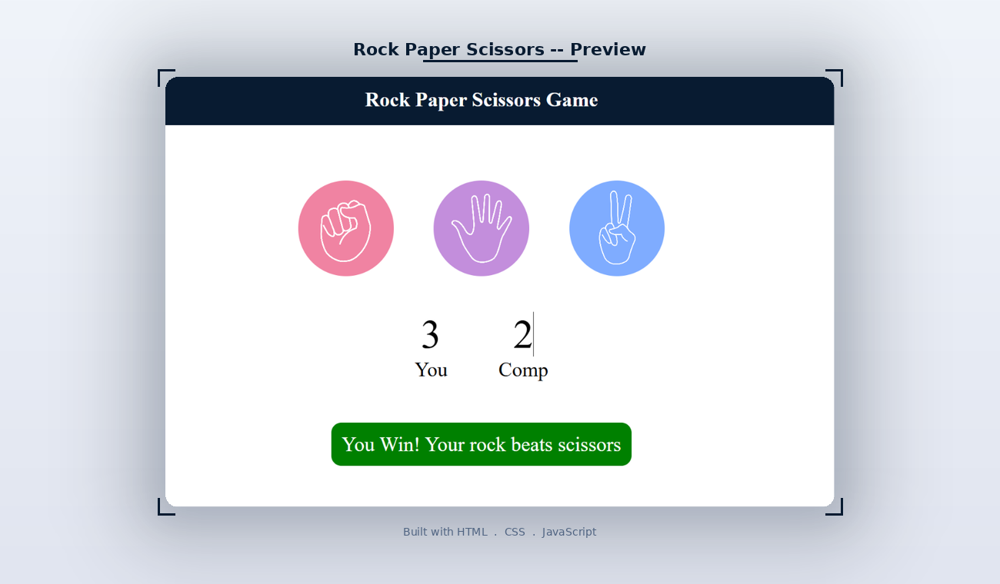

# Rock Paper Scissors Game

A browser-based Rock Paper Scissors game built with pure **HTML**, **CSS**, and **JavaScript**. Play against the computer, track your score, and get instant feedback on every move.

---

## Preview



---

## Features

- Play against a randomly generated computer move
- Instant win, lose, or draw feedback after every round
- Live score tracking for both player and computer
- Color-coded result messages (green for win, red for loss, navy for draw)
- Hover effect on choice circles
- Clean and minimal UI with no external libraries

---

## Project Structure

```
RockPaperScissors/
├── index.html          # Markup and structure
├── style.css           # Styling and layout
├── app.js              # Game logic and score tracking
├── preview.png         # Screenshot for README
└── Images/
    ├── rock.png        # Rock icon
    ├── paper.png       # Paper icon
    └── scissors.png    # Scissors icon
```

---

## Getting Started

1. Clone the repo
   ```bash
   git clone https://github.com/your-username/rock-paper-scissors.git
   cd rock-paper-scissors
   ```

2. Open in browser
   ```bash
   open index.html
   ```

No setup or dependencies needed.

---

## How to Play

1. Click on Rock, Paper, or Scissors
2. The computer picks a random move
3. The result appears in the message bar at the bottom
4. Scores update automatically after each round
5. Keep playing as long as you want

---

## How It Works

The computer choice is generated randomly from an array on every click:

```js
const genCompChoice = () => {
  const options = ["rock", "paper", "scissors"];
  const randomIdx = Math.floor(Math.random() * 3);
  return options[randomIdx];
};
```

The winner is determined using simple conditional logic comparing the player's choice to the computer's choice.

---

## Customization

### Change the header/button background color
In `style.css`:
```css
h1 {
  background-color: #081b31;
}
#msg {
  background-color: #081b31;
}
```

### Change circle hover color
```css
.choice:hover {
  background-color: #081b31;
}
```

### Reset scores on page reload
Scores reset automatically because they are stored in JavaScript variables (not localStorage), so refreshing the page clears them.

---

## Color Palette

| Element | Color |
|---------|-------|
| Header and buttons | `#081b31` Dark Navy |
| Win message | `green` |
| Lose message | `red` |
| Draw message | `#081b31` Dark Navy |
| Background | `white` |

---

## Author

**Kaneeza Batool**
CS Undergraduate, Sukkur, Pakistan
Built with HTML, CSS and JS
